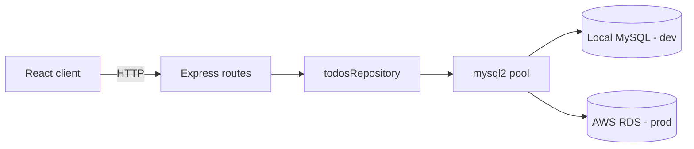

# MySQL Database Support — Server Design Spec

**Date:** 2026-05-23  
**Status:** Approved  
**Scope:** Server only (no client changes)

## Goal

Replace in-memory todo storage in the Express server with persistent MySQL storage. Support local MySQL during development and AWS RDS in production via environment-based configuration. Preserve the existing REST API contract so the React client continues to work unchanged.

## Background

The server (`server/index.js`) currently stores todos in a module-level array with a numeric `counter` for IDs. `mongoose` is listed in `package.json` but is not used. The client expects:

- Todo shape: `{ id, title, description, completed }` where `id` is a number and `completed` is a boolean.
- `PUT /todos/:id` and `DELETE /todos/:id` return the **full todo array**, not just the updated/deleted item.

## Architecture



### Layers

| Layer | Responsibility |
|-------|----------------|
| `config/database.js` | Read env vars, create `mysql2` connection pool, expose `testConnection()` |
| `repositories/todosRepository.js` | SQL for CRUD; map rows ↔ API JSON |
| `routes/todos.js` | HTTP handlers (async); same status codes and response bodies as today |
| `index.js` | Express setup, middleware, start server only after DB is reachable |

### Access layer choice

Use **`mysql2`** with a thin repository layer (not Sequelize or Prisma). Rationale: five endpoints and one table; minimal dependencies; same env-driven pool works for local MySQL and RDS.

Remove unused **`mongoose`** from `server/package.json`.

## Configuration

All connection settings come from environment variables. One code path for dev and prod; only values differ.

| Variable | Purpose | Dev example | Prod (RDS) example |
|----------|---------|-------------|---------------------|
| `DB_HOST` | Hostname | `127.0.0.1` | `xxx.region.rds.amazonaws.com` |
| `DB_PORT` | Port | `3306` | `3306` |
| `DB_USER` | Username | local user | RDS master user |
| `DB_PASSWORD` | Password | local password | RDS password |
| `DB_NAME` | Database name | `mern_todo` | `mern_todo` |
| `DB_SSL` | Enable TLS | `false` | `true` |

- Load variables with **`dotenv`** in development (`server/.env`, gitignored).
- In production, set the same variables on the deployment host (no `.env` file required).
- When `DB_SSL=true`, configure the pool SSL option for RDS.
- **Startup:** run a connection health check (`SELECT 1`) before `app.listen()`; exit or log clearly if the database is unreachable.

### AWS RDS (production notes)

- RDS security group must allow inbound TCP 3306 from the application host/security group.
- Use `DB_SSL=true` for encrypted connections.
- Optionally pin RDS CA bundle for strict certificate verification (can be added later).

## Database schema

**Database:** `mern_todo` (created manually before first migration)

**Table:** `todos`

```sql
CREATE TABLE todos (
  id INT UNSIGNED AUTO_INCREMENT PRIMARY KEY,
  title VARCHAR(255) NOT NULL,
  description TEXT,
  completed TINYINT(1) NOT NULL DEFAULT 0,
  created_at TIMESTAMP DEFAULT CURRENT_TIMESTAMP,
  updated_at TIMESTAMP DEFAULT CURRENT_TIMESTAMP ON UPDATE CURRENT_TIMESTAMP
);
```

- `id`: auto-increment integer (replaces in-memory `counter`).
- `completed`: stored as `TINYINT(1)`; repository maps to/from JavaScript `boolean`.
- `created_at` / `updated_at`: stored for auditing; **not** included in API responses unless added later.

Schema lives in `server/db/schema.sql`. Apply via optional `npm run db:migrate` script or manual `mysql` CLI on local and RDS.

## Repository API

`repositories/todosRepository.js` exports:

| Method | Behavior |
|--------|----------|
| `findAll()` | All todos, ordered by `id` ASC |
| `findById(id)` | Single row or `null` |
| `create({ title, description })` | Insert with `completed = 0`; return created row |
| `updateById(id, { title?, description?, completed? })` | Partial update; return updated row or `null` |
| `deleteById(id)` | Delete row; no return value required beyond success |

Row-to-JSON mapping:

```javascript
{ id, title, description, completed: Boolean(row.completed) }
```

## REST API contract (unchanged)

| Route | Status | Response body |
|-------|--------|----------------|
| `GET /todos` | 200 | `Todo[]` |
| `GET /todos/:id` | 200 / 404 | Single todo or empty 404 |
| `POST /todos` | 201 | Created todo `{ id, title, description, completed: false }` |
| `PUT /todos/:id` | 200 / 404 | **Full `Todo[]`** after update; 404 if id not found |
| `DELETE /todos/:id` | 200 | **Full `Todo[]`** after delete |

`PUT` partial updates: only apply fields present in the request body (`title`, `description`, `completed`), matching current behavior.

### Error handling

- Wrap async route handlers; catch DB errors.
- Log error details server-side.
- Return `500` with a generic message to the client (no SQL leakage).

## File layout

```
server/
  index.js
  package.json
  .env.example
  config/
    database.js
  db/
    schema.sql
    migrate.js          # optional: executes schema.sql
  repositories/
    todosRepository.js
  routes/
    todos.js
```

`body-parser` can remain or be replaced with `express.json()` (optional cleanup, not required for this feature).

## Dependencies

**Add:**

- `mysql2`
- `dotenv`

**Remove:**

- `mongoose`

## Development workflow

1. Ensure local MySQL is running.
2. `CREATE DATABASE mern_todo;`
3. Copy `server/.env.example` → `server/.env` with local credentials (`DB_SSL=false`).
4. Run schema (`npm run db:migrate` or `mysql ... < db/schema.sql`).
5. `npm start` in `server/`.
6. Verify CRUD via React app at `http://localhost:5173`.

## Production workflow (RDS)

1. Create RDS MySQL instance and database `mern_todo`.
2. Run the same `schema.sql` against RDS.
3. Set production environment variables (`DB_HOST`, `DB_SSL=true`, etc.).
4. Deploy server; confirm health check passes on startup.

## Out of scope

- Client changes
- Authentication / multi-user todos
- Docker Compose for MySQL (user has local MySQL installed)
- Automated integration tests (optional follow-up)
- Connection pooling tuning beyond defaults

## Success criteria

- Todos persist across server restarts.
- Local dev uses `.env` pointing at local MySQL.
- Production can point at RDS by changing env vars only.
- All existing client flows (list, add, edit, toggle complete, delete, filters) work without modification.
