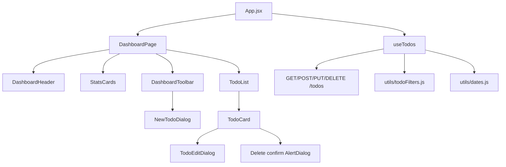

# Beautify Dashboard UI — Design Spec

**Date:** 2026-05-24  
**Status:** Draft  
**Source:** `products/beautify-FT.md`, [Figma — MyTodos](https://www.figma.com/design/SoM5WFNLtI087WnxNutKHL/MyTodos?node-id=0-1)  
**Scope:** Client only (no API or database changes)

## Goal

Refactor the React client to match the Figma “Todo Item Management System” glassmorphism dashboard. Replace Material UI with **shadcn/ui** (`Card`, `Button`, `Badge`), **lucide-react** icons, and **Tailwind CSS**. Preserve all existing todo behavior (CRUD, due datetime, overdue highlighting, filters, sort, dark mode). Organize UI under `src/components/dashboard/` with a thin `App.jsx`.

## Decisions (brainstorming)

| Topic | Decision |
|-------|----------|
| Table / Recharts | **Out of scope** — match Figma card list only |
| Existing behavior | **Keep all** — wire into new UI |
| Create flow | **Modal** via “New Todo” button |
| Edit flow | **Modal** (`TodoEditDialog`) |
| Delete | **AlertDialog** confirmation before delete |
| Migration strategy | **Full swap** — shadcn + Tailwind; remove MUI in same feature |
| Filter label “Done” | UI label only; state key remains `completed` |

## Background

Current client (`client/src/`):

- **MUI 5** — `App.jsx` (`ThemeProvider`), `AppBar`, `TodoUi`, `AddTodo`
- **Features** — CRUD via `fetch`, `completed` toggle, optional `dueDate` (datetime), filters (all / active / completed / overdue), sort (newest / dueDate), `utils/dates.js`
- **Config** — `API_BASE_URL` from `VITE_API_BASE_URL`

Server and MySQL layer are unchanged.

## Figma reference (node `1:2`)

Main frame: **Todo Item Management System** (~1024px content width).

### Layout regions

1. **Page** — diagonal gradient background (blue → purple → pink)
2. **Main glass card** — header, stats, toolbar
3. **Todo cards** — stacked below main card

### Design tokens

| Token | Value |
|-------|--------|
| Page gradient | `linear-gradient(153.94deg, #dbeafe 0%, #faf5ff 50%, #fce7f3 100%)` |
| Glass panel | `background: rgba(255,255,255,0.4)`; `border: 1px solid rgba(255,255,255,0.5)`; `border-radius: 24px`; `box-shadow: 0 25px 50px rgba(0,0,0,0.25)` |
| Stat / inner glass | `rgba(255,255,255,0.5)` border `white/50`, `border-radius: 16px` |
| Input / toolbar track | `border-radius: 14px` |
| Filter pills | `border-radius: 10px`; active = white + drop shadow |
| Primary text | `#1e2939` |
| Muted text | `#4a5565`, `#6a7282` |
| Placeholder | `#99a1af` |
| Stat — Total | `#155dfc` |
| Stat — Active | `#f54900` |
| Stat — Completed | `#00a63e` |
| CTA gradient | `#2b7fff` → `#ad46ff` |
| Icon tile gradient | `135deg, #2b7fff` → `#ad46ff` |
| Typography | **Inter** — 24px/36 title, 14px body, 16px controls, 18px todo title |
| Todo card | `rounded-2xl`, checkbox circle `border-2 #d1d5dc` |

Figma asset URLs from MCP are ephemeral (~7 days); use **lucide-react** equivalents in implementation.

## Architecture



### Approach

**Full stack swap + hook extraction** (recommended in brainstorming):

- Add Tailwind + shadcn + lucide; remove MUI in one feature branch
- `useTodos` owns server sync; pure `filterTodos` for list derivation
- Dashboard components are presentational

## File layout

```
client/
  src/
    App.jsx                      # theme (dark class), renders DashboardPage
    index.css                    # Tailwind + CSS variables (shadcn)
    lib/
      utils.js                   # cn() helper
    hooks/
      useTodos.js                # fetch, mutations, filter/sort/search state
    utils/
      dates.js                   # unchanged API
      todoFilters.js             # NEW: pure filter/sort/search
      todoFilters.test.js        # NEW: unit tests
    components/
      ui/                        # shadcn primitives (button, card, dialog, …)
      dashboard/
        DashboardPage.jsx
        DashboardHeader.jsx
        StatsCards.jsx
        DashboardToolbar.jsx
        NewTodoDialog.jsx
        TodoEditDialog.jsx
        TodoList.jsx
        TodoCard.jsx
```

### Removed after migration

| File / dep | Action |
|------------|--------|
| `components/AppBar.jsx` | Delete |
| `components/TodoUi.jsx` | Delete |
| `components/AddTodo.jsx` | Delete |
| `@mui/material`, `@emotion/*` | Uninstall |

## Component specifications

### DashboardPage

- Full-viewport min-height; page gradient (light/dark variants)
- Centered `max-w-[1024px]` container, `px-4 py-8`
- Renders: Header → main glass Card (stats + toolbar) → TodoList

### DashboardHeader

- Gradient icon tile (lucide `ListTodo` or `CheckSquare`, 32px, white icon)
- Title “My Todos”, subtitle “Organize your tasks beautifully”
- Dark mode toggle (lucide `Sun` / `Moon`) — toggles `dark` on `document.documentElement`, optional `localStorage` key `theme`

### StatsCards

- Grid: 3 columns `lg+`, wrap on smaller breakpoints
- Values: `total`, `active`, `completed` from hook `stats`
- Number colors per Figma tokens; labels “Total”, “Active”, “Completed”

### DashboardToolbar

| Control | Behavior |
|---------|----------|
| Search | `Input` with `Search` icon; filters title + description (client-side) |
| Filters | Pills: All, Active, Done (`completed`), Overdue |
| Sort | `Select`: Newest first / Due date soonest first |
| New Todo | Gradient `Button` → opens `NewTodoDialog` |

Active pill: white bg + shadow; inactive: transparent on glass track.

### NewTodoDialog

- Fields: title, description, optional `datetime-local` (step 1)
- Uses `normalizeDateTimeLocal` before POST
- Submit → `createTodo`; close on success
- Cancel / overlay dismiss

### TodoCard

- Glass card: checkbox (toggle complete), title, description, due row (`Calendar` icon + `formatDueDate`)
- `Badge` variant destructive: “Overdue” when `isOverdue(dueDate, completed)`
- Completed: line-through + reduced opacity
- Actions: `Pencil` → `TodoEditDialog`, `Trash2` → delete confirm

### TodoEditDialog

- Prefill title, description, due datetime from todo
- “Clear date & time” button
- Save → `updateTodo(id, { title, description, dueDate })`

### Delete confirmation

- shadcn `AlertDialog` on delete icon click
- Confirm → `deleteTodo(id)`

## Data flow (`useTodos`)

**State:** `todos`, `loading`, `error`, `filter`, `sort`, `search`

**Derived:**

- `stats` — `{ total, active, completed }`
- `visibleTodos` — `filterTodos(todos, { filter, sort, search })` using `compareDueDates`, `isOverdue` as needed

**Mutations:**

| Method | API |
|--------|-----|
| `createTodo` | POST `/todos`, then GET `/todos` (or use POST response + refetch) |
| `updateTodo` | PUT `/todos/:id` → set `todos` from response array |
| `deleteTodo` | DELETE `/todos/:id` → set `todos` from response array |
| `toggleCompleted` | PUT with `{ completed: !todo.completed }` |

**Initial load:** `GET /todos` on mount.

### `filterTodos` (pure)

```javascript
// filter: 'all' | 'active' | 'completed' | 'overdue'
// sort: 'newest' | 'dueDate'
// search: string (case-insensitive match on title + description)
```

## Responsive behavior

| Breakpoint | Behavior |
|------------|----------|
| `≥ lg` (1024px) | Figma-like single-row toolbar; 3-column stats |
| `md` | Toolbar wraps: search full width; filters + CTA second row |
| `< md` | Stats stack; toolbar vertical; cards full width; dialogs near full width |

## Dark mode

Apply `dark` class (shadcn convention):

| Element | Light | Dark |
|---------|-------|------|
| Page gradient | `#dbeafe → #faf5ff → #fce7f3` | Deeper slate → indigo → violet (reduced saturation) |
| Glass panels | `white/40` | `slate-900/60` |
| Glass borders | `white/50` | `white/10` |
| Primary text | `#1e2939` | `slate-100` |
| Muted text | `#4a5565` | `slate-400` |
| Stat accents | Figma hues | Same hues, slightly brighter |

## shadcn / Tailwind setup

1. Install Tailwind, PostCSS, Autoprefixer; configure `tailwind.config.js` with `darkMode: 'class'`
2. `npx shadcn@latest init` — path alias `@` → `client/src`
3. Add components: `button`, `card`, `badge`, `dialog`, `input`, `textarea`, `select`, `alert-dialog`, `label`
4. Install `lucide-react`, `class-variance-authority`, `clsx`, `tailwind-merge`
5. Load **Inter** (`@fontsource/inter` or `index.html` link)
6. Remove MUI packages and `ThemeProvider` / `CssBaseline`

## Error handling & empty states

| State | UI |
|-------|-----|
| Loading | Spinner or skeleton in `TodoList` |
| Fetch error | Alert + Retry (`refetch`) |
| Mutation error | Message in dialog; keep dialog open |
| No matches | “No todos match your filters” |
| Empty app | Empty state + “New Todo” CTA |

## Accessibility

- Dialogs: focus trap, Esc closes, `aria-labelledby`
- Icon buttons: `aria-label` per action
- Overdue: Badge + text (not color-only)

## Testing

| Test | Location |
|------|----------|
| Date helpers (existing) | `client/src/utils/dates.test.js` |
| Filter/sort/search (new) | `client/src/utils/todoFilters.test.js` |
| Manual | CRUD, modals, all filters, sort, search, overdue badge, dark mode, responsive |

**Verification:** `npm run lint`, `npm run test`, `npm run build` in `client/`.

## Out of scope

- Recharts, Table component
- Backend / MySQL changes
- New todo fields
- Authentication

## Success criteria

- [ ] UI matches Figma layout, spacing, typography, colors, and radii in light mode
- [ ] shadcn Card, Button, Badge used; lucide icons throughout
- [ ] All components live under `src/components/dashboard/` (+ `components/ui/`)
- [ ] `App.jsx` does not contain layout markup beyond theme + page wrapper
- [ ] MUI fully removed; client builds and lints clean
- [ ] All pre-refactor behaviors work: CRUD, due datetime, overdue, filters, sort, dark mode
- [ ] Search filters todos by title/description
- [ ] New Todo and Edit use modals
- [ ] Responsive from mobile to 1024px+

## Revision history

| Version | Date | Changes |
|---------|------|---------|
| 0.1 | 2026-05-24 | Initial design from brainstorming |
