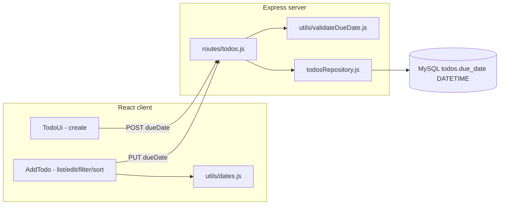

# Due Dates + Overdue Highlighting — Design Spec

**Date:** 2026-05-24  
**Status:** Approved (amended v1.1 — datetime precision)  
**PRD:** `products/2026-05-24-due-dates-overdue-highlighting-prd.md` (v0.2)

## Goal

Add optional due **date-times** to todos across the full MERN stack with **second-level** precision: persist `dueDate` via the REST API and MySQL `DATETIME`, display and edit date-times in the UI, highlight overdue incomplete items when `now` passes the deadline, and support client-side sort and an Overdue filter.

## Amendment summary (v1.0 → v1.1)

| Area | v1.0 (shipped in worktree) | v1.1 (target) |
|------|---------------------------|---------------|
| API `dueDate` | `YYYY-MM-DD` | `YYYY-MM-DDTHH:mm:ss` |
| MySQL column | `DATE` | `DATETIME` |
| Overdue | Before start of today (calendar day) | Strictly before current local instant (seconds) |
| UI input | `<input type="date">` | `<input type="datetime-local" step="1">` |
| Display | Date only | Date + time (seconds) |

Field name remains `dueDate` for API stability; semantics are date-time.

## Background

Initial implementation on `feature/due-dates` uses calendar dates. After manual QA, product requires **date-time accuracy to the second** so deadlines on the same day (e.g. 5:00 PM vs 2:00 PM) behave correctly for overdue and sorting.

MySQL support is on `main`; work continues in `.worktrees/feature/due-dates`.

## Architecture



### Layers

| Layer | Responsibility |
|-------|----------------|
| `server/utils/validateDueDate.js` | Validate `YYYY-MM-DDTHH:mm:ss`; reject date-only strings |
| `server/routes/todos.js` | HTTP; `400` on invalid input (unchanged flow) |
| `server/repositories/todosRepository.js` | Map `due_date` `DATETIME` ↔ API string |
| `server/config/database.js` | `dateStrings: ['DATE','DATETIME']` or format `DATETIME` in mapper |
| `server/db/migrations/002-due-date-to-datetime.sql` | `DATE` → `DATETIME`; legacy row normalization |
| `client/src/utils/dates.js` | Parse local datetime; `isOverdue` vs `now`; format with time |
| `client/src/components/TodoUi.jsx` | `datetime-local` create input |
| `client/src/components/AddTodo.jsx` | Display/edit/clear date-time |

## Data model

### API (camelCase)

```json
{
  "id": 1,
  "title": "Example",
  "description": "Details",
  "completed": false,
  "dueDate": "2026-05-24T17:30:45"
}
```

| Field | Type | Required | Default |
|-------|------|----------|---------|
| `dueDate` | `string \| null` | No | `null` |

**Canonical format:** `YYYY-MM-DDTHH:mm:ss` — local wall-clock, no timezone offset.

**Normalization:** Client may receive `datetime-local` values without seconds (`YYYY-MM-DDTHH:mm`); client normalizes to `:ss` before POST/PUT. Server rejects missing seconds.

### Database

```sql
due_date DATETIME NULL
```

**Migration from v1.0 `DATE`:**

1. `ALTER TABLE todos MODIFY due_date DATETIME NULL;` (MySQL converts existing dates to `YYYY-MM-DD 00:00:00`)
2. `UPDATE todos SET due_date = CONCAT(DATE(due_date), ' 23:59:59') WHERE due_date IS NOT NULL;` so prior “due that day” todos remain due until end of day
3. API layer formats MySQL `DATETIME` as `YYYY-MM-DDTHH:mm:ss` (space → `T` in mapper)

Repository `formatDueDate` → rename internally to `formatDueDateTime`:

```js
// DATETIME '2026-05-24 17:30:45' or Date → '2026-05-24T17:30:45'
```

Keep `dateStrings` for `DATETIME` in mysql2 to avoid JS `Date` timezone drift, or format consistently with UTC getters on naive strings only.

## Overdue definition

A todo is **overdue** when **all** are true:

1. `completed === false`
2. `dueDate !== null`
3. `parseLocalDateTime(dueDate) < now` (local, second precision; not strictly before → not overdue)

Completed todos are never overdue.

## Backend validation

`validateDueDate(value)` (name unchanged):

1. `null` / `undefined` → valid, `null`
2. String must match `^\d{4}-\d{2}-\d{2}T\d{2}:\d{2}:\d{2}$`
3. Validate calendar + clock components (including `2026-02-30T12:00:00`, hour 25, etc.)
4. Error: `Invalid dueDate; expected YYYY-MM-DDTHH:mm:ss or null`
5. **Reject** legacy `YYYY-MM-DD` with `400` (breaking change for API clients)

## Frontend behavior

### Create / edit

- `<input type="datetime-local" step="1" />`
- Helper `normalizeDateTimeLocal(value)` → append `:00` if length is 16 (`...THH:mm`)
- Labels: “Due date & time (optional)” / “Clear date & time”

### Display

- `formatDueDate(dueDate)` → e.g. `Due May 24, 2026, 5:30:45 PM` via `toLocaleString` with `hour`, `minute`, `second`

### Sort / filter

Unchanged pipeline; `compareDueDates` compares full datetime milliseconds.

## Resolved decisions

| # | Decision | Choice |
|---|----------|--------|
| D1 | Sort location | Client-only |
| D2 | Input control | `datetime-local` + `step="1"` |
| D3 | Overdue filter | Included |
| D4 | Clear UX | Explicit clear button |
| D5 | API format | `YYYY-MM-DDTHH:mm:ss` local wall-clock |
| D6 | Legacy `DATE` rows | Migrate to `23:59:59` on that day |
| D7 | Field name | Keep `dueDate` (datetime semantics) |

## Testing

| Area | Cases |
|------|-------|
| `validateDueDate` | Valid datetime; reject date-only; invalid clock; null |
| Repository | Round-trip `DATETIME`; migration fixture |
| `dates.js` | Overdue at second boundary; same-day future time; format includes seconds |
| Routes | POST/PUT reject `2026-05-24` without time |
| Manual | Pick time today; wait/pass second boundary; edit seconds |

## Out of scope

- UTC offsets / `Z` suffix on API
- Milliseconds
- Reminders, recurring todos

## Revision history

| Version | Date | Changes |
|---------|------|---------|
| 1.0 | 2026-05-24 | Initial approved design (calendar date) |
| 1.1 | 2026-05-24 | Datetime second precision; DATETIME column; instant overdue |
