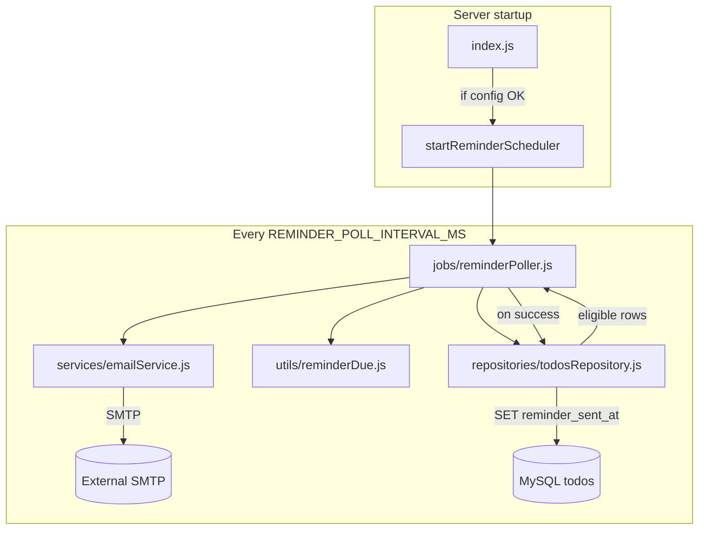

# Due-Date Email Reminders — Design Spec

**Date:** 2026-05-28  
**Status:** Approved  
**Approach:** Layered server modules (recommended option 2 from brainstorming)

## Goal

Send a **single email reminder** to a configured address when an incomplete todo’s due date-time is within a fixed lead window (e.g. one hour before). Reminders run **server-side** while the API process is up; no client UI changes in v1.

## Product decisions (brainstorming)

| Topic | Decision |
|--------|----------|
| Recipient | One global address: `REMINDER_EMAIL` in `.env` |
| Lead time | Fixed: `REMINDER_LEAD_MINUTES` in `.env` (default `60`) |
| Resend policy | **At most one email per todo, ever** (`reminder_sent_at` set after successful send) |
| Due date edits before send | Threshold uses **current** `due_date` at poll time; still only one send |
| Due date edits after send | No second email |
| Completed / no due date | Never send |
| Scheduler | In-process interval while `npm start` runs |
| Transport | SMTP via **Nodemailer** |
| Client | No changes in v1 |

## Background

- Due dates exist as naive local `YYYY-MM-DDTHH:mm:ss` (`due_date` `DATETIME`). See `docs/superpowers/specs/2026-05-24-due-dates-overdue-highlighting-design.md`.
- Prior PRD listed email reminders as out of scope; this feature intentionally adds them for the single-user/demo deployment model.
- No authentication or per-user profiles.

## Architecture



### Layers

| Module | Responsibility |
|--------|----------------|
| `server/config/reminders.js` | Load/validate env; `isRemindersEnabled()` |
| `server/utils/reminderDue.js` | Pure: is `now >= dueDate - leadMinutes`? |
| `server/repositories/todosRepository.js` | `findTodosPendingReminder()`; `markReminderSent(id)` |
| `server/services/emailService.js` | Nodemailer transport; `sendReminderEmail({ to, todo })` |
| `server/jobs/reminderPoller.js` | Interval: fetch → filter → send → mark |
| `server/index.js` | Start scheduler after DB OK; clear interval on shutdown |

HTTP routes are unchanged. Reminder logic does not live in `routes/todos.js`.

## Behavior

### When to send

All must be true:

1. `due_date IS NOT NULL`
2. `completed = 0`
3. `reminder_sent_at IS NULL`
4. Current local instant ≥ `due_date − REMINDER_LEAD_MINUTES` (same wall-clock semantics as `validateDueDate` / client `dates.js` — parse `due_date` components in Node, no API timezone suffix)

### When not to send

- Todo completed (before or at poll time)
- No due date
- `reminder_sent_at` already set
- Reminder env/SMTP not configured (scheduler disabled)

### Late server

If the process was down past the reminder instant, send on the **first successful poll after** the threshold (still one email total).

### Send pipeline (per todo)

1. Poller loads SQL candidates (`due_date` set, incomplete, not yet sent).
2. `reminderDue(dueDate, leadMinutes, now)` filters to those in the window.
3. `sendReminderEmail({ to: REMINDER_EMAIL, todo })`.
4. On SMTP success: `markReminderSent(id)` with current timestamp.
5. On SMTP failure: log error; **do not** set `reminder_sent_at` (retry on next poll).

### Email content (plain text)

- **Subject:** `Reminder: <title> due soon`
- **Body:** title, description (if any), formatted due date-time (`dueDate` API shape)

## Data model

### Schema change

```sql
ALTER TABLE todos
  ADD COLUMN reminder_sent_at DATETIME NULL DEFAULT NULL
  AFTER due_date;
```

- Canonical: `server/db/schema.sql`
- Migration: `server/db/migrations/003-todo-reminder-sent-at.sql`

### API

**Unchanged** public `Todo` JSON — `reminder_sent_at` is internal; omit from `mapRowToTodo`.

## Configuration

Reminders enabled only when all are set:

- `REMINDER_EMAIL`
- `REMINDER_LEAD_MINUTES` (positive integer; config loader defaults to `60` when reminders are otherwise enabled)
- `SMTP_HOST`, `SMTP_PORT`, `SMTP_USER`, `SMTP_PASS`, `SMTP_FROM`
- Optional: `SMTP_SECURE` (`true`/`false`, default `false` for port 587)
- Optional: `REMINDER_POLL_INTERVAL_MS` (default `60000`)

If incomplete config at startup: log warning once; do not start poller; API otherwise normal.

### `.env.example` additions

```
REMINDER_EMAIL=
REMINDER_LEAD_MINUTES=60
REMINDER_POLL_INTERVAL_MS=60000
SMTP_HOST=
SMTP_PORT=587
SMTP_SECURE=false
SMTP_USER=
SMTP_PASS=
SMTP_FROM=
```

## Repository query strategy

**v1:** SQL returns open candidates:

- `due_date IS NOT NULL AND completed = 0 AND reminder_sent_at IS NULL`

Final “in lead window” check in `reminderDue.js` (unit-testable, consistent with local datetime parsing). Dataset is small for demo/local use.

## Error handling

| Failure | Behavior |
|---------|----------|
| SMTP error | Log per todo; retry next poll |
| DB error in poller | Log; continue next interval |
| Shutdown | `clearInterval` in existing `shutdown()` |

## Dependencies

- `nodemailer` in `server/package.json`

## Testing

| Suite | File | Coverage |
|-------|------|----------|
| Unit | `test/reminderDue.test.js` | Before/at/after lead window; invalid/null due |
| Unit | `test/emailService.test.js` | Mock transport; subject/body |
| Integration | `test/reminderPoller.integration.test.js` or repository test | Insert todo, run send path with mock transport, assert `reminder_sent_at`; completed todo excluded |

Integration tests use `test/integrationEnv.js` and test DB only.

**Manual:** Mailtrap or Gmail app password; todo due in ~2 minutes with `REMINDER_LEAD_MINUTES=5`.

## Documentation updates

- `AGENTS.md`: remove email from “out of scope”; add reminder env + “server must be running for reminders” note.
- `server/.env.example`: new variables.

## Non-goals (v1)

- Per-todo recipient email field
- UI for lead time or enable/disable
- Multiple reminders per todo (e.g. 24h + 1h)
- Push or in-app notifications
- Auth / multi-user
- Separate OS cron worker or MySQL `EVENT` scheduler
- Timezone offsets on API (`Z` suffix) — unchanged from due-dates spec
- Exposing `reminderSentAt` in REST

## Risks and mitigations

| Risk | Mitigation |
|------|------------|
| Server not running → no email | Document; acceptable for v1 demo |
| SMTP credentials in `.env` | Never commit; `.env.example` only placeholders |
| Clock skew | Use same local parsing as due-date validation |
| Duplicate sends on race | Mark sent only after successful SMTP; optional `UPDATE ... WHERE reminder_sent_at IS NULL` in mark |

## Alternatives considered

1. **Monolith in `index.js`** — rejected; breaks layering.
2. **MySQL EVENT scheduler** — rejected; ops complexity, duplicates datetime semantics.
3. **HTTP transactional API (Resend/SendGrid)** — rejected; user chose SMTP/Nodemailer.
